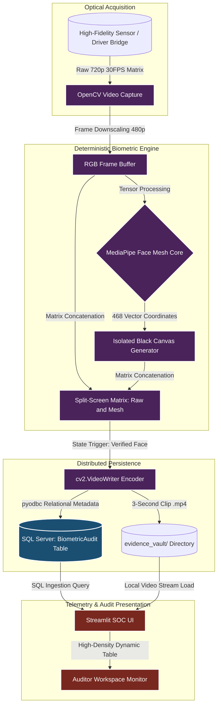

# **Biometric-KYC-Verification-Engine**
**Enterprise-Grade Biometric Video Audit and Liveness Detection KYC Pipeline**

## **1. Executive Summary**
The **Biometric-KYC-Verification-Engine** (codename **Sentinel**) is a high-performance, fault-tolerant biometric auditing pipeline engineered for financial identity verification (KYC) and anti-spoofing compliance. The system captures high-fidelity optical streams from hardware endpoints, processes the frame buffers using a deterministic facial mesh topology, and isolates biometric coordinates onto a synchronized dual-screen interface.

By transitioning from static image capture to temporal video auditing, Sentinel enforces "Liveness Detection"—recording ephemeral 3-second cryptographic-ready evidence clips (.mp4) upon positive identification. These forensic assets are tracked via a Microsoft SQL Server database ledger, while system operations are actively monitored through a specialized Security Operations Center (SOC) telemetry dashboard built on Streamlit.

## **2. Business Value & Core Protections**
In enterprise banking and fintech applications, simple static face recognition is highly vulnerable to presentation attacks (e.g., displaying a printed photograph or a digital screen to the lens). Sentinel mitigates these systemic risks through:
* **True Liveness Detection:** Captures a 3-second temporal frame vector sequence to guarantee the physical presence of the user, preventing synthetic identity spoofing.
* **Biometric Asepsis (Dual-Screen Isolation):** Segregates the raw RGB video stream from the computed geometric vector model (468-point Face Mesh map) inside a black-box canvas, facilitating pure biometric auditing without optical noise.
* **ACID-Compliant Forensic Ledger:** Ensures strict synchronization between physical video files stored in the local vault and relational metadata inside SQL Server, establishing an immutable audit trail for legal compliance.

## **3. High-Level Architectural Blueprint**

The pipeline isolates camera ingestion, mathematical geometric processing, relational persistence, and the visual SOC monitoring environment.


## 4. Technical Specification & Optimization
##### **4.1. Real-Time Matrix Manipulations (`vision_engine.py`)**
* **Matrix Concatenation:** To eliminate front-end overhead, the core engine clones the downscaled frame buffer and applies mathematical matrix joining via cv2.hconcat(). The left block handles the raw RGB matrix, and the right block structures a dark tensor np.zeros() where the 468 landmarks are explicitly plotted.

* **Frame-Rate and Resolution Synchronization:** The pipeline restricts processing dimensions to `640 X 480` at an optimized rate of 30 FPS. This intentional envelope prevents single-threaded CPU bottlenecking during vertex computation, guaranteeing deterministic performance on enterprise workstations.

* **Stateful Video Encoding:** Implements an asynchronous recording state machine using the `mp4v` codec container, ensuring zero frame dropping during disk write cycles.

##### **4.2. Relational Schema Architecture (`SQLQuery1.sql`)**
The persistence layer is managed by Microsoft SQL Server LocalDB, enforcing relational integrity constraints for rapid telemetry querying:

* **Evidence Tracking:** Replaces deprecated image mappings with dedicated semantic columns (`EvidenceFilename, EvidencePath`) explicitly provisioned to index multiplexed `.mp4` video forensic records.

* **Classification Meta-Tagging:** Sets default audit categorization parameters to `Liveness_Video_KYC` to structurally differentiate video telemetry from legacy data types.

##### **4.3. Command & Control SOC Center (`dashboard.py`)**
* **Asynchronous Media Rendering:** Leverages native `st.video()` encoding streams to pull forensic mp4 assets from the secure storage vault directly into an analytical multi-column grid view.

* **Isolated System Diagnostics:** Implements a localized file reader to surface the historical telemetry of the system (`vision_audit.log`), ensuring complete infrastructure transparency for security compliance officers.

## **5. Directory Topology**

```Biometric-KYC-Verification-Engine/
│
├── vision_engine.py             # Ingestion core, Split-Screen generator, Video writer & pyodbc sync
├── dashboard.py                  # Streamlit SOC terminal and evidence review workspace
├── SQLQuery1.sql                # Clean T-SQL Relational Schema mapping for Liveness Video assets
├── requirements.txt              # Production dependency manifests (opencv-python, mediapipe, numpy, pyodbc)
├── .gitignore                    # Tracking exclusion matrix (.venv, system log files)
└── README.md                     # High-Level Architectural Design Document
```
## **6. Execution Protocol**

##### **Step 1: Database Initialization**
Deploy the architectural schema script within your local Microsoft SQL Server instance to allocate the `VisionSecurityDB` context and table layout.

##### **Step 2: Dependency Provisioning**
Activate your isolated Python execution environment and install the verified architectural packages:
```Bash
python -m venv venv
source venv/bin/activate  # Windows Terminal: venv\Scripts\activate
pip install -r requirements.txt
```

##### **Step 3: Boot the Core Biometric Daemon**
Launch the primary optical acquisition engine:
```Bash
python vision_engine.py
```

##### **Step 4: Launch the Security Workspace**
Initialize the local web portal to audit live and historical verification metadata:
```Bash
streamlit run dashboard.py
```