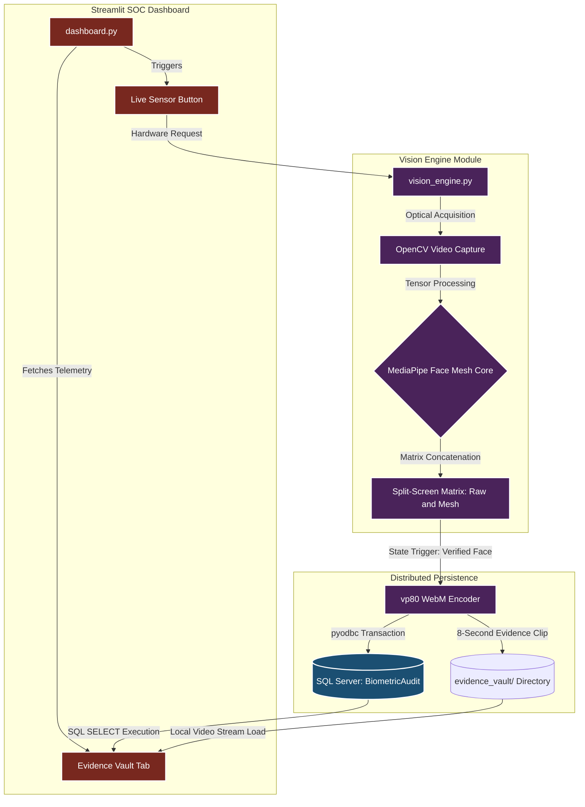

# **Biometric-KYC-Verification-Engine**
**Enterprise-Grade Biometric Video Audit and Liveness Detection KYC Pipeline**


---

## **1. Executive Summary**
The **Biometric-KYC-Verification-Engine** is a high-performance, fault-tolerant biometric auditing web application engineered for financial identity verification (KYC) and anti-spoofing compliance. The system captures high-fidelity optical streams directly through a browser-based interface, processes frame buffers using a deterministic facial mesh topology, and isolates biometric coordinates onto a synchronized dual-screen canvas. 

Transitioning from static image captures to temporal video auditing, the engine enforces "Liveness Detection" by recording cryptographic-ready evidence clips (`.webm`). These forensic assets are automatically indexed in a Microsoft SQL Server database, while system operations are actively monitored through a unified Security Operations Center (SOC) dashboard.

## **2. Business Value & Core Protections**
In enterprise banking and fintech applications, standard static facial recognition is highly vulnerable to presentation attacks (e.g., displaying a printed photograph or a digital screen to the lens). This architecture mitigates systemic risks through:
* **True Liveness Detection:** Captures an 8-second temporal frame vector sequence to guarantee the physical presence of the user, preventing synthetic identity spoofing.
* **Biometric Asepsis (Dual-Screen Isolation):** Segregates the raw RGB video stream from the computed geometric vector model (468-point Face Mesh map) inside a black-box canvas, facilitating pure biometric auditing without optical noise.
* **ACID-Compliant Forensic Ledger:** Ensures strict synchronization between physical video files stored in the local vault and relational metadata inside SQL Server, establishing an immutable audit trail for legal compliance.

## **3. Core Features & System Capabilities**
* **Unified Web Engine:** Seamlessly embeds the OpenCV/MediaPipe optical sensor into a Streamlit UI, eliminating the need for standalone terminal execution.
* **Browser-Native Encoding:** Transcodes dual-stream video evidence in real-time using the `vp80` codec (`.webm` container) to ensure native playback compatibility across all modern web browsers.
* **Zero-Trust Hardware Lifecycle:** Automatically binds to the hardware optical sensor upon authorization and forcefully releases the hardware `cap.release()` immediately after the 8-second capture cycle to prevent memory leaks and unauthorized background recording.

## **4. High-Level Architectural Blueprint**
The pipeline modularizes camera ingestion, mathematical geometric processing, relational persistence, and the visual SOC monitoring environment.



## **5. Database Relational Schema**
The persistence layer is managed by Microsoft SQL Server, enforcing relational integrity constraints for rapid telemetry querying. The system automatically syncs with the `BiometricAudit` table.

Primary Entity: `BiometricAudit`

* `EventID` (INT, PK) - Unique identifier for the KYC transaction.

* `CaptureTimestamp` (DATETIME) - Exact execution time of the biometric scan.

* `VerificationStatus` (VARCHAR) - System outcome (e.g., 'SUCCESS').

* `ConfidenceScore` (FLOAT) - Algorithmic confidence metric.

* `RawVideoFilename` / RawVideoPath (VARCHAR) - Absolute routing to the source `.webm` file.

* `MeshVideoFilename` / MeshVideoPath (VARCHAR) - Absolute routing to the isolated mesh `.webm` file.

* `HardwareSource` (VARCHAR) - The endpoint device used for optical capture.

## **6. Directory Topology**
The repository is structured to separate the presentation layer from the algorithmic engine.

```Biometric-KYC-Verification-Engine/
│
├── config.py                     # Database connection string and environment variables
├── vision_engine.py              # Modular ingestion core, Face Mesh computation, and WebM writer
├── dashboard.py                  # Main Streamlit web application and unified entry point
├── SQLQuery1.sql                 # T-SQL schema initialization script
├── requirements.txt              # Production dependency manifests
└── README.md                     # Architectural Design Document
```

## **7. Technical Specification & Optimization**
* **Python Environment Standardization:** The engine is specifically engineered for Python 3.11.x. This strict requirement bypasses C++ binary compilation errors inherent in bleeding-edge Python versions (like 3.14) when interfacing with MediaPipe's core tensor operations.

* **Matrix Concatenation:** To eliminate front-end overhead, the core engine clones the downscaled frame buffer and applies mathematical matrix joining via `cv2.hconcat()`.

* **Frame-Rate Synchronization:** The `VideoWriter` is strictly configured to execute at 8.0 FPS to match the computational loop of the MediaPipe mesh rendering, preventing timeline acceleration (Time-Lapse effect) and ensuring 1:1 real-time playback speed.

## **8. Integration & Scalability**
The modular nature of `vision_engine.py` allows the core logic to be abstracted and deployed to edge-computing hardware. The exact same algorithmic pipeline can be adapted to run on microcontrollers (e.g., Raspberry Pi 5, NVIDIA Jetson) to trigger physical relays for biometric access control systems, magnetic locks, or physical security turnstiles.

## **9. Execution & Deployment Protocol**
#### **Step 1: Database Initialization**
Deploy the architectural schema script (SQLQuery1.sql) within your local Microsoft SQL Server Management Studio (SSMS) to allocate the VisionSecurityDB context.

#### **Step 2: Environment Provisioning**
Ensure you are using Python 3.11. Activate your isolated virtual environment and install the enterprise dependencies:
```bash
py -3.11 -m venv venv
.\venv\Scripts\activate
pip install -r requirements.txt
```

#### **Step 3: Launch the Unified SOC**
Initialize the local web portal to access the biometric scanner and the forensic vault:

```Bash
streamlit run dashboard.py
```
Note: *The system will automatically create the required `evidence_vault` and `audit_logs` directories upon initial execution.*